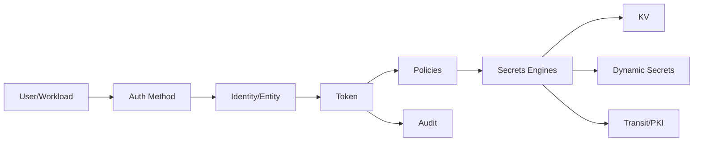

# HashiCorp Vault – Premium-Spickzettel

> [!abstract] Zweck
> Betriebsreferenz für Vault: Architektur, TLS, Initialisierung/Seal, Tokens, Policies, KV v2, Auth Methods, Audit, Transit, PKI, Leases, Integrated Storage/Raft, Snapshots, Upgrades, User Lockout, Diagnose und Incident Response.

> [!danger] Kein Dev-Mode in Produktion
> `vault server -dev` ist nur für Tests. Er ist bereits initialisiert/entsiegelt, verwendet vereinfachte Sicherheitsannahmen und besitzt keinen belastbaren Produktionszustand.

## Inhalt

- [[#Grundmodell]]
- [[#CLI und Umgebungsvariablen]]
- [[#Serverkonfiguration]]
- [[#Initialisierung, Seal und Recovery]]
- [[#Login, Tokens und Identitäten]]
- [[#Policies und Capabilities]]
- [[#Secrets Engines und KV v2]]
- [[#Auth Methods]]
- [[#Audit Devices]]
- [[#Transit]]
- [[#PKI]]
- [[#Leases und dynamische Secrets]]
- [[#Integrated Storage und Raft]]
- [[#Snapshots und Restore]]
- [[#User Lockout]]
- [[#Upgrade und Änderungskontrolle]]
- [[#Monitoring und Diagnose]]
- [[#Incident Response]]
- [[#Produktionscheckliste]]
- [[#Schnellreferenz]]

## Grundmodell

| Begriff | Bedeutung |
|---|---|
| Seal | kryptografische Sperre des Root-Key-Zugriffs |
| Unseal | Entsiegelung manuell oder per Auto-Unseal |
| Token | Vault-Identität mit Policies und TTL |
| Policy | pfadbasierte Capabilities in HCL |
| Auth Method | OIDC, LDAP, AppRole, Kubernetes usw. |
| Secrets Engine | speichert/erzeugt/verarbeitet Secrets |
| Lease | zeitlich begrenzte Gültigkeit dynamischer Secrets |
| Entity/Alias | zentrale Identität und Zuordnung mehrerer Logins |
| Audit Device | manipulationsresistenter Aktionsnachweis |
| Integrated Storage | eingebautes Raft-Storage/HA |



## CLI und Umgebungsvariablen

```bash
export VAULT_ADDR='https://vault.example.org:8200'
export VAULT_CACERT='/etc/ssl/certs/firma-ca.pem'
export VAULT_NAMESPACE='organisation/team-a'  # Enterprise/HCP, falls verwendet
```

```bash
vault version
vault -help
vault status
vault status -format=json
vault path-help secret/data/app
```

Ausgabe:

```bash
vault kv get -format=json secret/app
vault kv get -field=password secret/app
```

> [!warning]
> `VAULT_SKIP_VERIFY=true` nur für eng begrenzte Diagnose, nie als Dauerlösung. CA, SAN, Uhrzeit und Kette korrigieren.

Token nicht in Shell-History:

```bash
vault login
vault login -method=oidc
```

## Serverkonfiguration

Minimalbeispiel mit Raft:

```hcl
ui = true
api_addr     = "https://vault-1.example.org:8200"
cluster_addr = "https://vault-1.example.org:8201"

disable_mlock = false

storage "raft" {
  path    = "/opt/vault/data"
  node_id = "vault-1"
}

listener "tcp" {
  address            = "0.0.0.0:8200"
  cluster_address    = "0.0.0.0:8201"
  tls_cert_file      = "/etc/vault/tls/server.crt"
  tls_key_file       = "/etc/vault/tls/server.key"
  tls_client_ca_file = "/etc/vault/tls/client-ca.crt"
}

telemetry {
  prometheus_retention_time = "30s"
  disable_hostname = true
}
```

Start:

```bash
vault server -config=/etc/vault.d/vault.hcl
```

Konfiguration und Dienst:

```bash
systemctl status vault
journalctl -u vault -b
ss -ltnp | grep ':8200\|:8201'
```

> [!important]
> Konfigurationsparameter ändern sich. Für jede eingesetzte Version die offizielle Konfigurationsreferenz und den Upgrade-/Change-Tracker prüfen.

## Initialisierung, Seal und Recovery

Initialisieren:

```bash
umask 077
vault operator init -format=json > vault-init.json
```

> [!danger]
> Init-Datei, Unseal-Key-Shares und Initial-Root-Token sind Kronjuwelen. Nicht zusammen unverschlüsselt speichern. Verteilung, Quorum, Notfallzugang und Vernichtung dokumentieren.

Status:

```bash
vault status
```

Manuell unseal:

```bash
vault operator unseal
```

Rekey:

```bash
vault operator rekey -init
vault operator rekey
```

Root-Token nur im Notfall neu erzeugen:

```bash
vault operator generate-root -init
```

Auto-Unseal mit Cloud KMS/HSM reduziert manuelle Arbeit, verschiebt aber die Vertrauenskette. IAM, Schlüsselrotation, Region, Ausfall und Recovery separat testen.

## Login, Tokens und Identitäten

```bash
vault login -method=oidc
vault login -method=userpass username='alice'
vault token lookup
```

Token erstellen:

```bash
vault token create \
  -policy='app-read' \
  -ttl='1h' \
  -explicit-max-ttl='8h' \
  -renewable=true
```

Renew/Revoke:

```bash
vault token renew
vault token revoke TOKEN
vault token revoke -accessor ACCESSOR
vault token revoke -mode=path auth/token/create/app
```

> [!tip]
> Workloads mit kurzlebigen Authentisierungsmethoden statt statischer, langlebiger Tokens betreiben.

Identitäten:

```bash
vault list identity/entity/id
vault read identity/entity/id/ENTITY_ID
vault list identity/group/id
```

## Policies und Capabilities

`app-read.hcl`:

```hcl
path "secret/data/app/prod" {
  capabilities = ["read"]
}

path "secret/metadata/app/prod" {
  capabilities = ["read", "list"]
}
```

```bash
vault policy fmt app-read.hcl
vault policy write app-read app-read.hcl
vault policy read app-read
vault token capabilities secret/data/app/prod
```

KV-v2 trennt API-Pfade:

```text
data/      Secret-Versionen lesen/schreiben
metadata/  Metadaten, Liste, Versionsverwaltung
```

> [!warning]
> Wildcards und `sudo`-Capability nur bewusst. Policies addieren sich; ein „deny“ kann nötig sein, aber Gesamteffekt testen.

## Secrets Engines und KV v2

```bash
vault secrets list -detailed
vault secrets enable -path=secret kv-v2
```

Schreiben/Lesen:

```bash
vault kv put secret/app/prod username='svc-app' password='...'
vault kv get secret/app/prod
vault kv get -field=username secret/app/prod
```

Patch:

```bash
vault kv patch secret/app/prod username='svc-app-v2'
```

Versionen:

```bash
vault kv metadata get secret/app/prod
vault kv get -version=2 secret/app/prod
vault kv delete -versions=2 secret/app/prod
vault kv undelete -versions=2 secret/app/prod
vault kv destroy -versions=2 secret/app/prod
```

> [!danger]
> `destroy` löscht Versionen irreversibel. `delete` markiert nur gelöscht und kann ggf. zurückgenommen werden.

CAS:

```bash
vault kv put -cas=3 secret/app/prod password='neu'
```

## Auth Methods

```bash
vault auth list -detailed
vault auth enable oidc
vault auth enable approle
vault auth enable kubernetes
```

AppRole-Grundmuster:

```bash
vault write auth/approle/role/app \
  token_policies='app-read' \
  token_ttl='15m' \
  token_max_ttl='1h' \
  secret_id_ttl='10m' \
  secret_id_num_uses=1

vault read auth/approle/role/app/role-id
vault write -f auth/approle/role/app/secret-id
```

Login:

```bash
vault write auth/approle/login role_id='...' secret_id='...'
```

> [!warning]
> RoleID und SecretID nicht über denselben Kanal verteilen. Response Wrapping und kurzlebige Einmal-IDs bevorzugen.

OIDC/LDAP/Kubernetes immer mit Gruppen-/Claim-Zuordnung, TTLs und Revocation testen.

## Audit Devices

```bash
vault audit enable file file_path=/var/log/vault_audit.log
vault audit list -detailed
```

Syslog/Socket je nach Architektur.

> [!danger]
> Vault verweigert viele Anfragen, wenn kein Audit Device schreiben kann. Speicherplatz, Rotation, Rechte, SIEM-Ingestion und Ausfallverhalten überwachen.

Auditlogs enthalten gehashte/strukturierte sensible Metadaten. Zugriff und Retention streng regeln.

## Transit

```bash
vault secrets enable transit
vault write -f transit/keys/app-key
```

Verschlüsseln:

```bash
PLAINTEXT=$(printf '%s' 'geheim' | base64 -w0)
vault write transit/encrypt/app-key plaintext="$PLAINTEXT"
```

Entschlüsseln:

```bash
vault write -field=plaintext transit/decrypt/app-key ciphertext='vault:v1:...' | base64 -d
```

Rotation/Rewrap:

```bash
vault write -f transit/keys/app-key/rotate
vault write transit/rewrap/app-key ciphertext='vault:v1:...'
```

> [!note]
> Transit speichert standardmäßig nicht die Anwendungsdaten, sondern schützt kryptografische Operationen. Schlüsselpolitik, Backups und Restore bleiben kritisch.

## PKI

```bash
vault secrets enable pki
vault secrets tune -max-lease-ttl=87600h pki
```

Für Produktion Root-CA offline und Vault als Intermediate:

```bash
vault write -format=json pki/intermediate/generate/internal \
  common_name='Example Intermediate CA' \
  issuer_name='example-intermediate' \
  | jq -r '.data.csr' > intermediate.csr
```

Nach externer Signatur:

```bash
vault write pki/intermediate/set-signed certificate=@intermediate-chain.pem
```

Rolle:

```bash
vault write pki/roles/web \
  allowed_domains='example.org' \
  allow_subdomains=true \
  max_ttl='720h' \
  key_type='ec' \
  key_bits=256
```

Ausstellen:

```bash
vault write pki/issue/web \
  common_name='app.example.org' \
  alt_names='app-internal.example.org' \
  ttl='168h'
```

CRL/OCSP, AIA/CDP, Issuer-Rotation, TTL und private Schlüsselzuständigkeit planen.

## Leases und dynamische Secrets

```bash
vault lease lookup LEASE_ID
vault lease renew LEASE_ID
vault lease revoke LEASE_ID
vault lease revoke -prefix database/creds/app
```

Dynamische DB-Credentials:

```bash
vault secrets enable database
vault read database/creds/app-role
```

> [!important]
> Anwendung muss Erneuerung, Ablauf und Verbindungswechsel beherrschen. Dynamisch bedeutet nicht automatisch robust.

## Integrated Storage und Raft

```bash
vault operator raft list-peers
vault operator raft autopilot state
vault operator raft join https://vault-1.example.org:8200
```

Knoten entfernen nur nach Runbook:

```bash
vault operator raft remove-peer NODE_ID
```

Quorum, Failure Domains, Latenz, TLS und genügend freien Speicher überwachen.

## Snapshots und Restore

```bash
vault operator raft snapshot save vault-$(date +%F).snap
```

Prüfen und sicher übertragen:

```bash
sha256sum vault-*.snap
chmod 600 vault-*.snap
```

Restore:

```bash
vault operator raft snapshot restore vault-2026-07-17.snap
```

> [!danger]
> Restore ersetzt den Clusterzustand. Version, Seal-Konfiguration, Clusterstatus, Wartungsfenster, Rückfallplan und Wiederanlauf testen. Snapshots verschlüsselt und getrennt aufbewahren.

## User Lockout

Vault kann bei unterstützten Auth Methods Benutzer nach wiederholten Fehlversuchen sperren. Relevante Punkte:

- Schwelle;
- Beobachtungsfenster;
- Sperrdauer;
- Ausnahmen/Deaktivierung;
- Monitoring und Helpdesk-Prozess;
- Brute-Force-Schutz versus DoS-Risiko.

Aktive Konfiguration gegen die Versionsdokumentation prüfen. Lockouts nicht mit Token-/Policy-Fehlern verwechseln.

## Upgrade und Änderungskontrolle

Vor Upgrade:

```text
[ ] Zielversion und alle Zwischenversionen geprüft
[ ] Change-/Upgrade-Tracker gelesen
[ ] Breaking Changes, Deprecations, Lizenz/Edition
[ ] Plugins, Seal, Storage, Auth, PKI inventarisiert
[ ] Snapshot und Restore-Test
[ ] Staging mit Produktionskopie/ähnlicher Last
[ ] Rollbackgrenze dokumentiert
[ ] Monitoring und Wartungsfenster
```

Clusterweise:

1. Snapshot.
2. Standby-Knoten aktualisieren.
3. Health und Raft prüfen.
4. Leadership kontrolliert wechseln.
5. bisherigen Leader aktualisieren.
6. Funktions- und Auth-Tests.

> [!warning]
> Nicht jede Storage-/Datenmigration ist rückwärtskompatibel. „Binärdatei zurückkopieren“ ist kein verlässlicher Rollback.

## Monitoring und Diagnose

Status:

```bash
vault status
vault read sys/health
curl --cacert firma-ca.pem https://vault.example.org:8200/v1/sys/health
```

Logs:

```bash
journalctl -u vault -b
vault monitor -log-level=debug
vault debug
```

Metrics:

```bash
curl --header "X-Vault-Token: $VAULT_TOKEN" \
  https://vault.example.org:8200/v1/sys/metrics?format=prometheus
```

Wichtige Signale:

- sealed/active/standby;
- request latency/error rates;
- token/lease growth;
- audit failures;
- Raft peer/commit/index;
- storage space;
- leadership changes;
- auth failures/lockouts;
- Zertifikatsablauf;
- clock drift.

| Meldung | Prüfen |
|---|---|
| `connection refused` | Dienst, Adresse, Listener, Firewall |
| `x509 unknown authority` | CA, SAN, Zeit, Kette |
| `permission denied` | Token, Policies, Namespace, Pfad |
| `missing client token` | Login/Token Helper |
| `Vault is sealed` | Seal/KMS/Unseal |
| `no handler for route` | Mount/Pfad/Version |
| KV `unsupported path` | KV-v1/v2 verwechselt |
| Raft-Knoten fehlt | Join, TLS, Clusteradresse, Peers |

## Incident Response

### Verdächtiges Token

```bash
vault token lookup TOKEN
vault token revoke TOKEN
# oder Accessor
vault token revoke -accessor ACCESSOR
```

Danach:

- Auditkorrelation;
- abgeleitete Tokens/Leases widerrufen;
- betroffene Secrets rotieren;
- Auth-Quelle prüfen;
- Scope und Zeitfenster bestimmen;
- Evidenz sichern;
- Ursache beheben.

### Root-/Unseal-Material betroffen

Notfallrunbook, Rekey/Recovery, KMS/HSM, Root-Token-Neuerzeugung und vollständige Rotation mit Fachverantwortlichen durchführen. Keine improvisierte Einzelaktion.

## Produktionscheckliste

```text
[ ] TLS und Trust validiert
[ ] kein Dev-Mode
[ ] Root-Token nicht im Tagesbetrieb
[ ] Auto-Unseal oder belastbares Quorum
[ ] Least-Privilege-Policies
[ ] kurzlebige Workload-Identitäten
[ ] mindestens ein überwacht schreibfähiges Audit Device
[ ] Raft/HA über Failure Domains
[ ] Backups automatisiert, verschlüsselt, Restore getestet
[ ] Monitoring, NTP, Kapazität, Zertifikatsalarm
[ ] Break-Glass und Incident Runbook
[ ] Change-/Upgradeprozess
```

## Schnellreferenz

```bash
vault status
vault login
vault secrets list -detailed
vault auth list -detailed
vault policy list
vault kv put secret/app key=value
vault kv get secret/app
vault token lookup
vault audit list
vault operator raft list-peers
vault operator raft snapshot save vault.snap
```

## Quellen

- [Vault Documentation](https://developer.hashicorp.com/vault/docs)
- [Vault CLI](https://developer.hashicorp.com/vault/docs/commands)
- [Server configuration](https://developer.hashicorp.com/vault/docs/configuration)
- [Integrated Storage](https://developer.hashicorp.com/vault/docs/configuration/storage/raft)
- [Production hardening](https://developer.hashicorp.com/vault/docs/concepts/production-hardening)
- [KV v2](https://developer.hashicorp.com/vault/docs/secrets/kv/kv-v2)
- [Policies](https://developer.hashicorp.com/vault/docs/concepts/policies)
- [User lockout](https://developer.hashicorp.com/vault/docs/concepts/user-lockout)
- [Upgrade and change tracker](https://developer.hashicorp.com/vault/docs/updates)

## Verwandte Notizen

- [[OpenBao-Premium-Spickzettel]]
- [[OpenSSL-Premium-Spickzettel]]
- [[Keytool-Premium-Spickzettel]]
- [[KI-Flottenmanagement-Premium-Spickzettel]]
