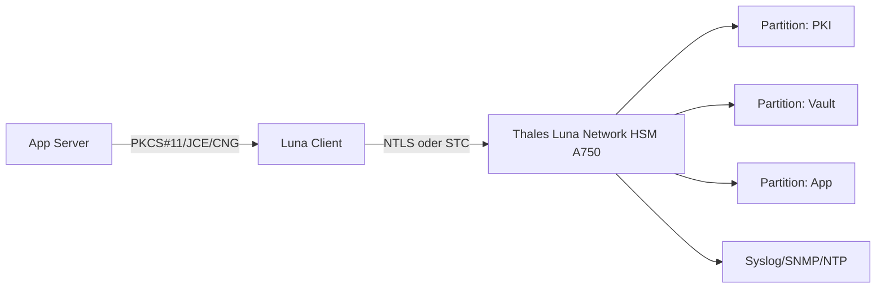
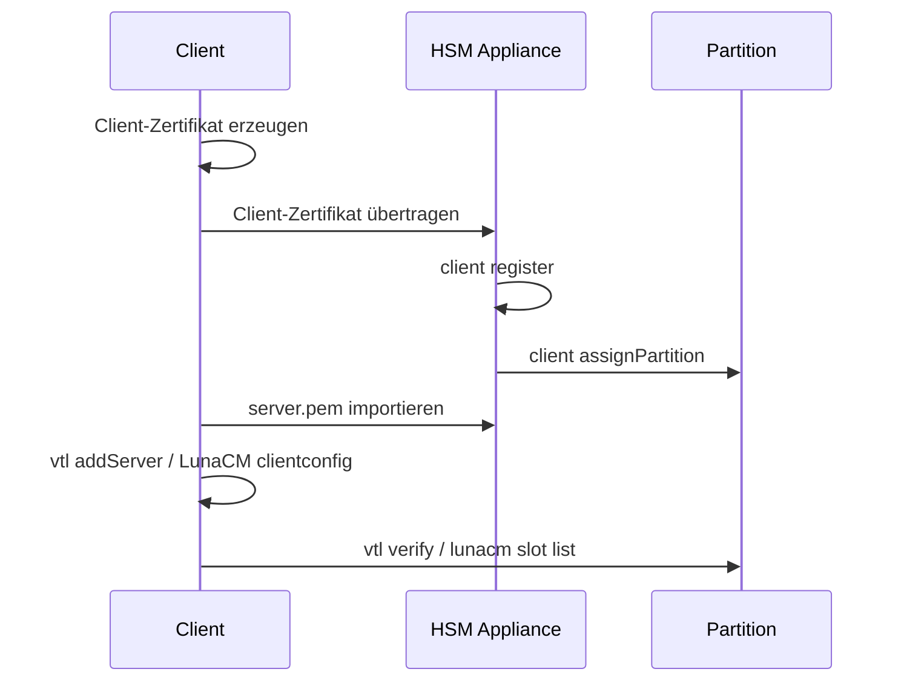
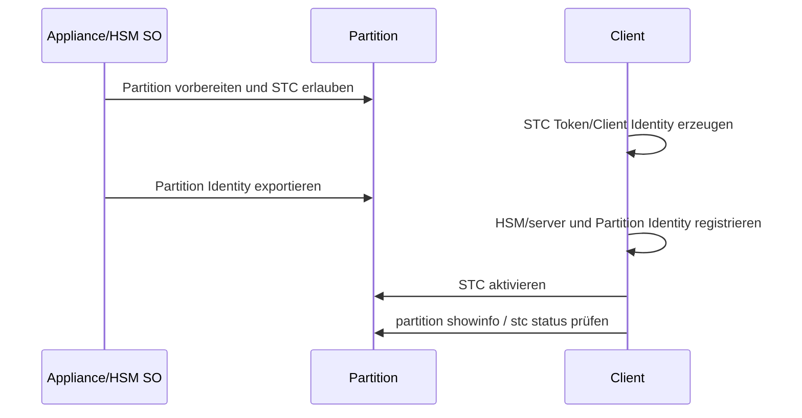
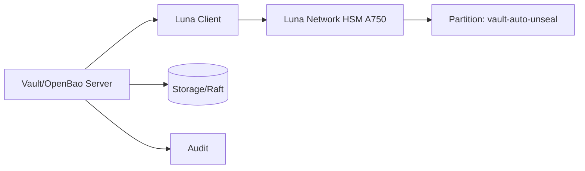
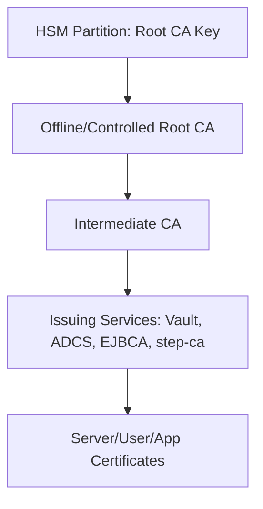

# Thales Luna Network HSM A750 – Premium-Spickzettel

> [!abstract] Zweck
> Praxis- und Betriebsreferenz für ein **Thales Luna Network HSM A750**: Modellabgrenzung, Rollen, LunaSH, LunaCM, Clientanbindung, NTLS, STC, Partitionen, PKCS#11, Java/JCE, OpenSSL, Vault/OpenBao-Anbindung, Backup, Monitoring, FIPS-Betrieb, Diagnose und Betriebschecklisten.

> [!important] Namensklärung
> „Thales A750 HSM“ ist im Luna-7-Kontext typischerweise ein **Luna Network HSM A750** oder ein entsprechendes Luna-A750-Modell. Die **A-Serie** nutzt passwortbasierte Authentifizierung. Die **S-Serie** nutzt Multifaktor-/PED-Quorum-Authentifizierung. Vor produktiven Kommandos immer Typenschild, Bestellung, Firmware, Appliance-Software und Lizenz-/Partitionserweiterungen gegen die lokale Umgebung prüfen.

> [!danger] HSM-Arbeiten sind Schlüsselmaterial-Arbeiten
> `hsm init`, `partition delete`, `partition clear`, Factory Reset, Policy-Änderungen, Firmwarewechsel, Partition-Resize, Backup-/Restore und Domänenänderungen können Schlüsselmaterial, Compliance-Status oder Wiederherstellbarkeit dauerhaft beeinflussen. Ohne Change, Vier-Augen-Prüfung, Backup-Konzept und dokumentierte Rollback-Entscheidung nicht ausführen.

## Inhalt

- [[#Kurzprofil A750]]
- [[#Begriffe und Rollenmodell]]
- [[#Werkzeuge und Pfade]]
- [[#Sicherheitsprinzipien]]
- [[#Betriebsdaten erfassen]]
- [[#Netzwerk und Appliance-Basis]]
- [[#Partitionen]]
- [[#Client-Anbindung mit NTLS]]
- [[#Client-Anbindung mit STC]]
- [[#LunaCM am Client]]
- [[#PKCS11 und Anwendungen]]
- [[#Java JCAJCE]]
- [[#OpenSSL und PKCS11]]
- [[#Vault und OpenBao]]
- [[#PKI-Root-CA-Betrieb]]
- [[#Backup, HA und Disaster Recovery]]
- [[#Monitoring, Audit und Logging]]
- [[#FIPS und Compliance]]
- [[#Firmware, Updates und Wartung]]
- [[#Fehlerbilder und Diagnose]]
- [[#Betriebschecklisten]]
- [[#Schnellreferenz]]
- [[#Quellen]]

## Kurzprofil A750

| Punkt | Einordnung |
|---|---|
| Produktfamilie | Thales Luna Network HSM 7 / Luna A-Serie |
| Modell | A750, Enterprise-Performance-Klasse |
| Authentifizierung | Passwortbasiert, nicht PED-Quorum wie S-Serie |
| Speicher | 16 MB, ab Firmware 7.7.0 in den Luna-7-Dokumenten 32 MB |
| Partitionen | 5 Partitionen, typischerweise auf 20 erweiterbar |
| Netzwerk | Network-HSM-Appliance, Clientzugriff über NTLS oder STC |
| APIs | PKCS#11, Java JCA/JCE, Microsoft CAPI/CNG, REST/Pycryptoki je Softwarestand und Paket |
| Betrieb | Appliance-Admin über LunaSH; Partition/App-Admin meist über LunaCM und Clientbibliotheken |
| Monitoring | Syslog, SNMP, Appliance-/HSM-Statusbefehle |
| Compliance | FIPS-Betrieb nur mit passender Firmware, Policies und dokumentierter Betriebsweise behaupten |

> [!note] Performanceangaben
> Hersteller- und Resellerwerte sind modell-, firmware-, algorithmus-, key-size-, policy-, HA-, Netzwerk- und Client-abhängig. Für SLA oder Kapazitätsplanung eigene Messungen mit realistischen Workloads durchführen, nicht nur Datenblattwerte übernehmen.

### Was ein Network HSM leistet

Ein Network HSM speichert private Schlüssel und kryptografische Objekte in einer dedizierten Sicherheitskomponente. Anwendungen greifen über Clientbibliotheken und zugewiesene Partitionen darauf zu. Typische Einsatzfälle:

- Root- oder Intermediate-CA-Schlüssel schützen;
- Vault/OpenBao Auto-Unseal oder Seal-Wrapping stützen;
- Signaturen zentral ausführen;
- TLS-Offloading oder Applikationsschlüssel schützen;
- Mandanten über Partitionen trennen;
- Auditierbarkeit und Schlüssel-Lifecycle verbessern.

### Was es nicht automatisch löst

- Schlechte Rollen- und Passwortprozesse;
- fehlende Backups oder fehlende Restore-Tests;
- falsch konfigurierte Anwendungen;
- kompromittierte Clients mit legitimer Partition-Berechtigung;
- schlecht dokumentierte Key Ceremonies;
- fehlende Trennung zwischen Appliance-Admin, HSM-SO, Partition-SO und Anwendungsbetrieb.

## Begriffe und Rollenmodell

| Begriff | Bedeutung |
|---|---|
| Appliance | 1U-Netzwerkgerät mit Managementsystem, Netzwerk, Services und eingebautem HSM-Modul |
| LunaSH | Shell auf der Appliance, erreichbar über SSH oder Konsole |
| LunaCM | Clientseitiges Administrationswerkzeug für sichtbare HSM-Slots/Partitionen |
| VTL | Virtual Token Library Utility; ältere/weiterhin vorhandene Client-Hilfsprogramme |
| HSM SO | Security Officer des HSM, verwaltet HSM-weite Aktionen und Policies |
| Partition | Logische Trennung für Anwendungen/Mandanten; erscheint clientseitig als Slot/Token |
| Partition SO | Eigentümer/Administrator einer Partition |
| Crypto Officer | Rolle für Schlüssel- und Objektverwaltung in einer Partition |
| Crypto User | eingeschränkte Nutzungsrolle für kryptografische Operationen |
| Auditor | Audit-Rolle für HSM-Auditlogs, unabhängig vom normalen Adminbetrieb |
| NTLS | Network Trust Link Service, TLS-basierte Client-Appliance-Verbindung mit Zertifikaten |
| STC | Secure Trusted Channel, stärkerer Client-Partition-Kanal mit Endpunktbindung an Partition |
| Chrystoki.conf / Crystoki.ini | Clientkonfiguration für Luna-Bibliotheken |
| PKCS#11 | Standard-API für kryptografische Token/HSMs |
| Cloning Domain | Domänengeheimnis für Backup/HA/Cloning-Kompatibilität zwischen Partitionen |

### Rollen sauber trennen

| Aufgabe | Typische Rolle | Nicht vermischen mit |
|---|---|---|
| Appliance-Netzwerk, SSH, Syslog | Appliance-Admin | Partition-Schlüsselverwaltung |
| HSM-Initialisierung, HSM-Policies | HSM SO | Applikationsbetrieb |
| Partition erzeugen/zuweisen | HSM SO oder Appliance-Admin je Aktion | Crypto-User-Nutzung |
| Partition initialisieren | Partition SO | Appliance-Root-Administration |
| Schlüssel erzeugen/importieren | Crypto Officer | Appliance-Netzwerkbetrieb |
| Schlüssel verwenden | Crypto User / Anwendung | Schlüsselverwaltung |
| Auditlogs verwalten | Auditor | HSM SO und Crypto Officer |
| Notfallzugriff | Break-glass-Team | Tagesbetrieb |

> [!tip] Gute Betriebsregel
> Jede produktive Partition hat mindestens: Eigentümer, Zweck, Datenklasse, erlaubte Clients, zuständige Admins, Backupstatus, Restore-Testdatum, FIPS-/Policy-Status, Ablauf für Passwortwechsel und Löschfreigabe.

## Werkzeuge und Pfade

### Appliance-Seite

```text
ssh admin@<hsm-appliance>
lunash:> help
lunash:> hsm show
lunash:> partition list
lunash:> client list
lunash:> service list
lunash:> network show
```

Typische LunaSH-Bereiche:

| Bereich | Zweck |
|---|---|
| `hsm` | HSM-weite Informationen, Login, Policies, Initialisierung, Firmware-nahe Aufgaben |
| `partition` | Partitionen erstellen, anzeigen, initialisieren, Policies, Backup/Restore |
| `client` | NTLS-Clients registrieren, anzeigen, Partitionen zuweisen/revozieren |
| `service` | Dienste prüfen/steuern, je Version |
| `network` | Netzwerkstatus und -konfiguration, je Version |
| `syslog` / `sysconf` | Systemkonfiguration, Fingerprints, Logging, je Version |
| `audit` | Auditrollen und Auditlogfunktionen |

> [!warning] Syntax variiert nach Version
> LunaSH- und LunaCM-Kommandos sind versionsabhängig. Immer `help`, `?`, `command -help` und die zum installierten Release passende Thales-Dokumentation verwenden.

### Client-Seite Linux

Typische Installationspfade, abhängig von Paket und Distribution:

```bash
/opt/safenet/lunaclient/
/usr/safenet/lunaclient/
/etc/Chrystoki.conf
```

Inventur:

```bash
which lunacm || true
which vtl || true
which cmu || true
ldconfig -p | grep -Ei 'Cryptoki|luna|safenet' || true
find /usr /opt -iname 'libCryptoki2_64.so' 2>/dev/null
```

LunaCM starten:

```bash
lunacm
```

VTL prüfen:

```bash
vtl -h
vtl listServers
vtl listSlots
vtl verify
```

PKCS#11 allgemein prüfen:

```bash
pkcs11-tool --module /usr/safenet/lunaclient/lib/libCryptoki2_64.so -L
pkcs11-tool --module /usr/safenet/lunaclient/lib/libCryptoki2_64.so -O --slot <slot-id>
```

### Client-Seite Windows

Typische Orte:

```powershell
C:\Program Files\SafeNet\LunaClient\
C:\Program Files\SafeNet\LunaClient\crystoki.ini
```

Prüfen:

```powershell
Get-ChildItem 'C:\Program Files\SafeNet\LunaClient' -Recurse -Filter '*Cryptoki*' |
  Select-Object FullName
```

Als Administrator ausführen, wenn Clientkonfiguration oder Zertifikatsspeicher geändert wird.

## Sicherheitsprinzipien

### Grundsätze

1. **Nie ohne Backup-Strategie produktive Schlüssel erzeugen.**
2. **Nie produktive Partitionen löschen oder neu initialisieren, wenn Restore nicht bewiesen ist.**
3. **Nie HSM-, Partition- oder Crypto-Passwörter in Tickets, Shell-History oder Unit-Files im Klartext speichern.**
4. **Nie Testclients dauerhaft auf produktive Partitionen berechtigen.**
5. **Nie Compliance behaupten, ohne Firmware, Policies, Security Policy, Betriebsprozess und Evidenz zu prüfen.**
6. **Nie nur Applikationsfunktion testen; immer auch Backup/Restore, Audit, Monitoring und Notfallzugriff testen.**

### Passwort- und Geheimnisregeln

```text
[ ] HSM-SO-Passwort in Tresor, nicht in Personenpostfach
[ ] Partition-SO-Passwort getrennt vom Crypto-Officer-Passwort
[ ] Crypto-User nur wenn Anwendung wirklich eingeschränkt arbeiten soll
[ ] Passwortrotation mit Testplan
[ ] Break-glass-Zugriff protokolliert
[ ] Verantwortliche und Stellvertretung benannt
[ ] Passwörter nie in Bash-History, systemd unit, CI-Log, Terraform-State
```

Shell-History für HSM-Arbeiten reduzieren:

```bash
set +o history
# sensible Kommandos interaktiv ausführen
set -o history
```

Besser: keine Passwörter in CLI-Argumenten übergeben, sondern interaktive Prompts oder geschützte Secret-Mechanismen nutzen.

### Change-Fenster

Vor einem HSM-Change:

```text
[ ] Ziel und Nicht-Ziele beschrieben
[ ] betroffene Partitionen und Clients bekannt
[ ] letzter Restore-Test bekannt
[ ] Backup/HA-Status grün
[ ] Audit/Logging aktiv
[ ] konkrete Kommandoliste peer-reviewed
[ ] Abbruchkriterien definiert
[ ] Kommunikationskanal offen
[ ] Herstellerdoku-Version dokumentiert
[ ] Screenshots/Outputs mit Seriennummern und Geheimnissen bereinigt
```

## Betriebsdaten erfassen

### Minimalinventur Appliance

```text
Hostname:
Management-IP:
Produkt-/Seriennummer:
Modell:
Appliance Software:
HSM Firmware:
HSM Capabilities:
FIPS-Zielzustand:
Partitionserweiterung:
Supportvertrag:
Standort/Rack:
Stromkreise:
Netzwerkports/VLANs:
Syslog-Ziel:
SNMP/Monitoring:
NTP-Quelle:
Backup-HSM:
HA-Partner:
```

### LunaSH-Inventur

```text
lunash:> hsm show
lunash:> hsm showinfo
lunash:> hsm showpolicies
lunash:> partition list
lunash:> client list
lunash:> service list
lunash:> network show
lunash:> sysconf fingerprint -ssh
```

Falls ein Befehl nicht existiert:

```text
lunash:> help
lunash:> hsm help
lunash:> partition help
lunash:> client help
```

### Client-Inventur

```bash
uname -a
cat /etc/os-release 2>/dev/null
id
getent group hsmusers || true
find /usr /opt -iname 'libCryptoki2_64.so' 2>/dev/null
vtl listServers
vtl listSlots
vtl verify
lunacm <<'LUNA'
slot list
exit
LUNA
```

> [!warning] Outputs bereinigen
> Seriennummern, Hostnames, Zertifikatsfingerprints, Partitionlabels und Fehlermeldungen können intern schutzbedürftig sein. Vor Weitergabe an Tickets oder externe Stellen bereinigen.

## Netzwerk und Appliance-Basis

### Zielbild



### Netzwerkanforderungen

| Thema | Empfehlung |
|---|---|
| VLAN | HSM-Management und Client-HSM-Verkehr getrennt planen, sofern möglich |
| DNS | Hostnamen stabil halten; bei hostnamebasierter Clientregistrierung DNS-Ausfall bedenken |
| NTP | Zeitquelle vor Zertifikats- und Auditbetrieb korrekt konfigurieren |
| Firewall | Nur benötigte Clients und Managementstationen zulassen |
| IPv6 | NTLS kann IPv6 nutzen; STC-Einschränkungen je Version beachten |
| Monitoring | Syslog und SNMP vor Produktionsfreigabe anbinden |
| Zugriff | SSH nur für Adminnetze, MFA/VPN/Jump Host nach lokaler Policy |

### Vor Clientanbindung prüfen

```bash
ping <hsm-hostname-oder-ip>
nc -vz <hsm-hostname-oder-ip> 22
nc -vz <hsm-hostname-oder-ip> <ntls-port>
```

Portnummern und Dienste nicht auswendig übernehmen. In der lokalen Doku, Firewallmatrix und Appliance-Konfiguration prüfen.

### SSH-Fingerprint prüfen

Vor erstem Login:

```text
lunash:> sysconf fingerprint -ssh
```

Den angezeigten Fingerprint über einen zweiten Kanal mit der Adminseite vergleichen.

> [!warning]
> Wenn ein HSM ersetzt, neu installiert oder umbenannt wurde, können SSH- und Serverzertifikate legitime Änderungen haben. Nicht blind `known_hosts` löschen, sondern Ursache und Change-ID prüfen.

## Partitionen

### Partition planen

```text
Name/Label:
Zweck:
Owner:
Datenklasse:
Clients:
Rollen:
Crypto-Mechanismen:
FIPS-Policy:
Cloning Domain:
Backup-Ziel:
HA-Gruppe:
Monitoring:
Löschfreigabe:
```

### Partitionen anzeigen

```text
lunash:> partition list
lunash:> partition show -partition <partition_name>
lunash:> partition showpolicies -partition <partition_name>
```

### Partition erstellen

Die genaue Syntax hängt von Firmware, Lizenz und Zielmodell ab:

```text
lunash:> hsm login
lunash:> partition create -partition <partition_name> -size <size>
lunash:> partition list
lunash:> partition show -partition <partition_name>
```

> [!tip]
> Partitiongrößen nicht „so klein wie möglich“ wählen. Zertifikats-/PKI-, Vault- und HA-/Backup-Anforderungen vorher berücksichtigen. Zu kleine Partitionen erzeugen später unnötige Change-Risiken.

### Partition initialisieren

Je Betriebsmodell gibt es zwei typische Varianten:

| Variante | Einsatz |
|---|---|
| LunaSH auf Appliance | Wenn Appliance- und Partition-Administration in einer Hand liegen |
| LunaCM auf Client | Wenn Partitionseigentümer separat verwaltet und die Partition clientseitig initialisiert werden soll |

LunaSH-Beispiel, Platzhalter prüfen:

```text
lunash:> partition init -partition <partition_name>
```

LunaCM-Beispiel:

```text
lunacm:> slot list
lunacm:> slot set -slot <slot>
lunacm:> partition init -label <label>
lunacm:> role init -name co
lunacm:> role login -name co
lunacm:> role init -name cu
```

> [!danger] STC-Hinweis
> Thales warnt in der Dokumentation, STC-Partitionen nicht mit dem falschen Initialisierungsweg zu behandeln. Bei STC insbesondere die versionspassende Anleitung verwenden und die Partition-/Clientverbindung danach prüfen.

### Nach Initialisierung prüfen

```text
lunacm:> slot list
lunacm:> slot set -slot <slot>
lunacm:> partition showinfo
lunacm:> role list
lunacm:> partition showpolicies
```

Wenn Partition-Flags oder Domänenstatus nicht erwartungsgemäß sind: **nicht produktiv nutzen**, sondern Ursache klären.

### Partition löschen oder leeren

```text
# Erst nach bestätigter Löschfreigabe und Backup-/Restore-Entscheidung!
lunash:> client show -client <client_name>
lunash:> client revokePartition -client <client_name> -partition <partition_name>
lunash:> partition delete -partition <partition_name>
```

> [!danger]
> `partition clear`, `partition delete` und Neuinitialisierung sind destruktiv. Ein HSM-Backup ist nur dann ein Backup, wenn Restore in einer vergleichbaren Umgebung erfolgreich getestet wurde.

## Client-Anbindung mit NTLS

NTLS ist der klassische, performanceorientierte Clientzugriff über gegenseitige Zertifikatsauthentifizierung. Der Client sieht danach zugewiesene Partitionen als Slots.

### NTLS Ablaufbild



### Client-Zertifikat erzeugen

Auf dem Client:

```bash
cd /usr/safenet/lunaclient/bin 2>/dev/null || cd /opt/safenet/lunaclient/bin
sudo ./vtl createCert -n <client_hostname_oder_ip>
```

Zertifikat zur Appliance übertragen:

```bash
scp <client_cert>.pem admin@<hsm-hostname-oder-ip>:
```

### Client auf Appliance registrieren

Auf der Appliance:

```text
lunash:> client register -client <client_name> -hostname <client_hostname>
# oder, wenn Zertifikate/IPs so geplant sind:
lunash:> client register -client <client_name> -ip <client_ip>
```

Prüfen:

```text
lunash:> client list
lunash:> client show -client <client_name>
```

### Partition zuweisen

```text
lunash:> partition list
lunash:> client assignPartition -client <client_name> -partition <partition_name>
lunash:> client show -client <client_name>
```

Bei hostnamebasierter Registrierung lokale Zuordnung für Ausfallszenarien prüfen:

```text
lunash:> client hostip map -client <client_name> -ip <client_ip>
```

### Serverzertifikat auf Client registrieren

Serverzertifikat holen:

```bash
scp admin@<hsm-hostname-oder-ip>:server.pem ./server-<hsm>.pem
```

Fingerprint prüfen:

```bash
./vtl fingerprint -c ./server-<hsm>.pem
```

Server eintragen:

```bash
sudo ./vtl addServer -n <hsm-hostname-oder-ip> -c ./server-<hsm>.pem
sudo ./vtl listServers
sudo ./vtl verify
```

> [!note]
> Viele neuere Clientkonfigurationsfunktionen sind in LunaCM beziehungsweise `clientconfig` verfügbar. `vtl` ist weiterhin relevant, aber nicht jede Umgebung sollte neue Automationen auf alte VTL-Muster bauen.

### One-Step-NTLS

Wenn der Clientadministrator berechtigt ist und die Organisation es erlaubt:

```text
lunacm:> clientconfig deploy -server <hsm> -client <client> -partition <partition_name>
```

Nur verwenden, wenn Verantwortlichkeiten, Passwortübergabe, Audit und Change-Protokoll sauber geregelt sind.

### NTLS Fehlerbilder

| Symptom | Prüfen |
|---|---|
| `vtl verify` sieht keinen Slot | Client registriert, Partition zugewiesen, server.pem importiert, Firewall, DNS/IP, Zertifikat-CN |
| Zertifikatsfehler | Hostname/IP passt nicht zum Zertifikat, falsches server.pem, alte Client-Zertifikate |
| Nur ein Client betroffen | Chrystoki.conf, Berechtigungen, hsmusers-Gruppe, Client-Zertifikat, lokale Firewall |
| Alle Clients betroffen | Appliance-Service, Netzwerk, Zertifikatserneuerung, HSM-Status, Partitionen |
| Nach IP-/Hostnamewechsel defekt | Server-/Clientzertifikate und bekannte Host-/Servereinträge erneuern |

## Client-Anbindung mit STC

STC ist der stärker abgesicherte Client-Partition-Kanal. Es schützt Kommunikation stärker bis zur Partition, verursacht aber mehr Overhead und hat versions-/netzwerkabhängige Einschränkungen.

### Wann STC sinnvoll ist

| Situation | Bewertung |
|---|---|
| Cloud/VM/Auto-Scaling | STC oft besser geeignet, weil Identität nicht nur klassisch hostgebunden ist |
| Hohe Integritätsanforderung | STC bevorzugt prüfen |
| Höchste Performance | NTLS oft einfacher und performanter |
| IPv6-only | STC-Unterstützung genau prüfen; NTLS ist meist die sichere Wahl |
| Gemischte Clients auf gleichem HSM | Pro Client/HSM-Beziehung NTLS und STC nicht unbedacht mischen |

### STC Basisablauf



### Typische Kommandoskizze

Client Identity erzeugen:

```text
lunacm:> stc tokeninit -label <token_label>
lunacm:> stc identitycreate -label <client_identity>
lunacm:> stc identityshow
```

Partition Identity auf der Appliance exportieren, Syntax je Firmware prüfen:

```text
lunash:> partition stcidentity -partition <partition_name>
```

Clientseitig registrieren und aktivieren, genaue Parameter je Version prüfen:

```text
lunacm:> stc partitionregister ...
lunacm:> stc enable -id <server_id>
lunacm:> stc status
```

> [!warning]
> STC hat harte Versionstabellen. Firmware, Appliance Software und Luna HSM Client müssen zusammenpassen. Bei Upgrades zuerst Kompatibilitätsmatrix und Release Notes lesen.

## LunaCM am Client

### Grundbedienung

```text
lunacm:> help
lunacm:> slot list
lunacm:> slot set -slot <slot>
lunacm:> partition showinfo
lunacm:> partition showpolicies
lunacm:> role list
lunacm:> role login -name co
lunacm:> role logout
lunacm:> exit
```

### Objekte anzeigen

```text
lunacm:> partition contents
```

Wenn Anwendung und Admin parallel arbeiten, niemals aus reiner Neugier produktive Objekte ändern oder löschen.

### Mechanismen anzeigen

```text
lunacm:> mechanism list
```

Mechanismen und FIPS-Status immer mit Policies und Firmware abgleichen. Nur weil ein Mechanismus technisch angezeigt wird, ist er nicht automatisch für die lokale Compliance erlaubt.

### Skriptmodus

Nicht jede LunaCM-Version ist bequem skriptbar. Für Abfragen können Here-Docs funktionieren:

```bash
lunacm <<'LUNA'
slot list
exit
LUNA
```

Skripte mit Logbereinigung bauen:

```bash
#!/usr/bin/env bash
set -Eeuo pipefail
LOG=/var/log/hsm/lunacm-check.log
mkdir -p "$(dirname "$LOG")"
{
  date -Is
  lunacm <<'LUNA'
slot list
exit
LUNA
} | sed -E 's/(Serial Number ->).*/\1 REDACTED/' >> "$LOG"
```

## PKCS11 und Anwendungen

### PKCS#11-Bibliothek finden

```bash
find /usr /opt -type f -name 'libCryptoki2_64.so' 2>/dev/null
```

Typischer Pfad:

```text
/usr/safenet/lunaclient/lib/libCryptoki2_64.so
```

### Slots anzeigen

```bash
pkcs11-tool --module /usr/safenet/lunaclient/lib/libCryptoki2_64.so -L
```

### Objekte anzeigen

```bash
pkcs11-tool --module /usr/safenet/lunaclient/lib/libCryptoki2_64.so \
  --slot <slot> --login --list-objects
```

> [!warning]
> Objektnamen, Labels, IDs und Mechanismen können sicherheitsrelevante Architekturinformationen preisgeben. Logs schützen.

### Testschlüssel nur in Testpartition

```bash
pkcs11-tool --module /usr/safenet/lunaclient/lib/libCryptoki2_64.so \
  --slot <slot> --login \
  --keypairgen --key-type rsa:2048 \
  --label test-delete-me --id 54455354
```

Löschen:

```bash
pkcs11-tool --module /usr/safenet/lunaclient/lib/libCryptoki2_64.so \
  --slot <slot> --login \
  --delete-object --type privkey --label test-delete-me
```

> [!danger]
> Keine Testobjekte in produktiven PKI-/Vault-Partitionen erzeugen. Nicht alle Anwendungen ignorieren fremde Objekte sauber.

### HSM-Usergruppe unter Linux

Viele Luna-Installationen nutzen eine Gruppe wie `hsmusers`. Dienstbenutzer müssen Zugriff auf Clientbibliothek, Konfiguration und Gerätedateien haben.

```bash
getent group hsmusers
id vault
sudo usermod -aG hsmusers vault
sudo systemctl restart vault
```

Danach neue Login-Session oder Dienstneustart, weil Gruppenmitgliedschaften nicht rückwirkend in bestehende Prozesse wandern.

## Java JCA/JCE

### Provider-Konzept

Java-Anwendungen nutzen das HSM meist über einen PKCS#11-Provider. Varianten:

- SunPKCS11-Konfiguration;
- vendor-spezifischer Provider, falls geliefert;
- Anwendungsspezifische HSM-Adapter.

Beispielhafte SunPKCS11-Konfiguration:

```properties
name = LunaA750
library = /usr/safenet/lunaclient/lib/libCryptoki2_64.so
slotListIndex = 0
```

Startbeispiel:

```bash
java \
  -Djava.security.debug=sunpkcs11,provider \
  -jar app.jar
```

> [!warning]
> Java-Security-Debug kann vertrauliche Provider-, Slot- und Zertifikatsdaten loggen. Nur kontrolliert und zeitlich begrenzt nutzen.

### Keystore-Zugriff

```bash
keytool -list \
  -storetype PKCS11 \
  -providerClass sun.security.pkcs11.SunPKCS11 \
  -providerArg luna-pkcs11.cfg
```

Je Java-Version hat sich die SunPKCS11-Einbindung verändert. Mit der Ziel-JDK-Version testen, nicht mit einer Admin-Workstation-Version.

### Häufige Java-Probleme

| Fehler | Ursache |
|---|---|
| Provider lädt nicht | falscher Librarypfad, 32/64-bit-Mismatch, fehlende Gruppenrechte |
| Slot nicht gefunden | Chrystoki.conf, NTLS/STC, vtl verify, falscher slotListIndex |
| Login scheitert | falsches Rollenpasswort, PIN-Handling der App, gesperrte Rolle |
| Mechanismus nicht verfügbar | FIPS-Policy, Firmware, Keytyp, Provider-Beschränkung |
| App hängt beim Start | HSM nicht erreichbar, Timeout zu hoch, DNS/Firewall, HA-Failover |

## OpenSSL und PKCS11

OpenSSL 3 arbeitet mit Providern. Viele ältere Beispiele nutzen Engines. Welche Variante funktioniert, hängt von Distribution, OpenSSL-Version und installierten PKCS#11-Komponenten ab.

### Version prüfen

```bash
openssl version -a
openssl list -providers
openssl list -engines 2>/dev/null || true
```

### PKCS#11 mit p11-kit prüfen

```bash
p11tool --list-tokens 2>/dev/null || true
```

### Signaturtest mit PKCS#11 URI

Je Toolchain:

```bash
openssl dgst -sha256 -sign 'pkcs11:token=<token>;object=<key>;type=private' data.bin > sig.bin
```

> [!note]
> Syntax für PKCS#11-URIs, Provider und PIN-Handling ist distributions- und paketabhängig. Vor Produktiveinsatz einen minimalen Test mit nicht-produktiver Partition dokumentieren.

## Vault und OpenBao

### Typische Architektur



### Vault Enterprise PKCS#11 Seal

HashiCorp Vaults PKCS#11-Seal ist ein Enterprise-/HSM-Feature. Beispielhafte Struktur:

```hcl
seal "pkcs11" {
  lib            = "/usr/safenet/lunaclient/lib/libCryptoki2_64.so"
  slot           = "<decimal-slot-id>"
  pin            = "<nicht-im-file-speichern>"
  key_label      = "vault-hsm-key"
  hmac_key_label = "vault-hsm-hmac-key"
}
```

> [!danger] PIN nicht in Klartext-Konfigurationsdateien
> Der Beispielblock zeigt die benötigte Struktur, nicht die empfohlene Secret-Ablage. PINs über geschützte Secret-Mechanismen, Dateirechte, systemd Credentials oder lokalen Tresorprozess handhaben.

### OpenBao PKCS#11 Seal

OpenBao kann PKCS#11 über HSM-fähige Builds beziehungsweise KMS-Plugins verwenden. Die Details hängen stark von OpenBao-Version und Pluginmodell ab.

Beispielhafte Struktur:

```hcl
seal "pkcs11" {
  lib         = "/usr/safenet/lunaclient/lib/libCryptoki2_64.so"
  token_label = "OpenBao"
  pin         = "<nicht-im-file-speichern>"
  key_label   = "bao-root-key-aes"
  mechanism   = "AES_GCM"
}
```

### Systemd-Dienst prüfen

```bash
systemctl cat vault
systemctl show vault -p User -p Group -p SupplementaryGroups
id vault
getent group hsmusers
sudo -u vault pkcs11-tool --module /usr/safenet/lunaclient/lib/libCryptoki2_64.so -L
```

Falls interaktiv funktioniert, systemd aber nicht:

```bash
sudo usermod -aG hsmusers vault
sudo systemctl daemon-reload
sudo systemctl restart vault
journalctl -u vault -b --no-pager
```

### Diagnose für Vault/OpenBao

| Symptom | Prüfen |
|---|---|
| `HSM feature required` | Vault-Edition/Lizenz, HSM-fähiges Binary, Featureumfang |
| Slot nicht sichtbar | Dienstbenutzer, hsmusers, Chrystoki.conf, NTLS/STC, vtl verify |
| Unseal hängt | HSM-Verfügbarkeit, DNS, Firewall, HA, Timeout, PIN-Handling |
| Nach Reboot defekt | Luna Client Service, Netzroute, systemd-Reihenfolge, Gruppenmitgliedschaft |
| Nach Key-Rotation defekt | alte Keylabels noch vorhanden, Seal-Rewrap, Konfigurationsstand |

## PKI-Root-CA-Betrieb

### HSM als Root-CA-Schutz

Bei Root-CAs ist der HSM-Nutzen besonders hoch: der private Root-Key verlässt den geschützten Bereich nicht oder nur nach dokumentierter Backup-/Cloning-Regel. Der eigentliche CA-Prozess muss trotzdem sauber sein.



### Key Ceremony Mindestinhalt

```text
[ ] Ziel und Scope
[ ] Rollen und Personen
[ ] Identitätsprüfung der Beteiligten
[ ] HSM-Seriennummer und Firmware
[ ] Partitionlabel und Policies
[ ] FIPS-/Compliance-Ziel
[ ] Algorithmus und Keygröße
[ ] CSR-/Zertifikatsparameter
[ ] Backup/Restore-Plan
[ ] Auditlog-Export
[ ] Screenshots/Logs bereinigt
[ ] Versiegelte Passwort-/Recovery-Ablage
[ ] Abnahmeunterschriften
```

### CA-Key nicht blind exportierbar machen

Exportierbarkeit erleichtert Migrationen, reduziert aber den HSM-Schutz. Entscheidung dokumentieren:

| Option | Vorteil | Risiko |
|---|---|---|
| nicht exportierbarer Key | stärkster HSM-Schutz | Migration/Backup nur über HSM-Mechanismen |
| exportierbarer/wrappable Key | flexibler bei Migration/DR | höhere Prozess- und Zugriffssensibilität |
| HSM-Backup/Cloning Domain | kontrolliertes DR | muss getestet und sicher verwahrt werden |

## Backup, HA und Disaster Recovery

### Backup-Strategie

```text
[ ] Welche Partitionen werden gesichert?
[ ] Welches Backup-HSM oder HA-Ziel?
[ ] Welche Cloning Domain?
[ ] Wer besitzt Passwörter und Rollen?
[ ] Wie oft Backup?
[ ] Wo liegt Backup?
[ ] Wann wurde Restore getestet?
[ ] Wie wird Restore auditierbar dokumentiert?
[ ] Wie werden alte Backups vernichtet?
```

### Backup-Grundsätze

- Backup-HSM und Quellpartition müssen kompatibel sein.
- Cloning Domain muss für Backup/Restore passen.
- Backup ohne Restore-Test ist eine Annahme, kein Nachweis.
- Backups sind ebenfalls hochschutzbedürftiges Schlüsselmaterial.
- HA ersetzt Backup nicht; HA repliziert unter Umständen auch Fehlbedienungen.

### HA-Gruppe

HA schützt vor Ausfall einzelner HSMs oder Partitionen, erfordert aber identische/kompatible Policies und Domänen.

Prüfen:

```text
lunacm:> ha help
lunacm:> ha list
```

Vor HA-Änderungen:

```text
[ ] alle Mitglieder erreichbar
[ ] Partitionen gleiche Rolle/Policy/Domäne
[ ] Anwendung mit HA-Slot getestet
[ ] Failover getestet
[ ] Monitoring erkennt Member-Ausfall
[ ] Rückbau dokumentiert
```

## Monitoring, Audit und Logging

### Monitoringziele

| Ziel | Beispiele |
|---|---|
| Verfügbarkeit | Appliance erreichbar, NTLS/STC ok, Slots sichtbar |
| Kapazität | Partition-Speicher, Objektanzahl, Performance |
| Sicherheit | Logins, Policyänderungen, Clientregistrierungen, Partitionänderungen |
| Compliance | Firmware, FIPS-Policy, Auditlog-Kette |
| Betrieb | Temperatur, Netzteile, Netzwerkports, Services |

### Syslog

```text
lunash:> syslog help
lunash:> syslog show
```

In SIEM/Logsystem aufnehmen:

```text
[ ] HSM-Auditlogs
[ ] Appliance-Systemlogs
[ ] Admin-Logins
[ ] Clientregistrierungen
[ ] Partitionzuweisungen
[ ] Policyänderungen
[ ] Firmware-/Serviceereignisse
```

### SNMP

```text
lunash:> service list
lunash:> snmp help
```

Keine unsicheren Community Strings. SNMPv3 bevorzugen, wenn verfügbar und organisatorisch unterstützt.

### Audit-Rolle

Audit ist nicht nur „mehr Logging“, sondern Bestandteil des Nachweises. Audit-Rolle, Logrotation, Export und Integrität separat planen.

```text
[ ] Auditor-Rolle besetzt
[ ] Auditpasswort getrennt verwahrt
[ ] Auditlog-Export regelmäßig
[ ] Logintegrität geprüft
[ ] SIEM-Regeln aktiv
[ ] Alarm bei deaktiviertem Audit
```

## FIPS und Compliance

### Wichtige Unterscheidung

| Aussage | Bedeutung |
|---|---|
| Produkt ist FIPS-validiert | Ein bestimmtes Modul/Firmware/Policy-Set ist validiert |
| System läuft FIPS-konform | Lokale Konfiguration nutzt validierte Firmware und Approved Mode |
| Anwendung ist compliant | Auch Client, Prozess, Schlüssel, Algorithmen und Betrieb sind geprüft |

> [!warning]
> FIPS ist kein Aufkleber auf dem Rack. Für Audits braucht man Firmwarestände, Security Policy, HSM Policies, Mechanismen, Betriebsdokumentation und Nachweise.

### FIPS-Prüfblock

```text
lunash:> hsm show
lunash:> hsm showpolicies
lunash:> hsm showmechanism
lunacm:> partition showpolicies
lunacm:> mechanism list
```

Dokumentieren:

```text
Firmware:
Certificate:
FIPS approved configuration:
Nicht erlaubte Mechanismen gesperrt:
Keys in approved algorithms:
Audit aktiv:
Change-ID:
Prüfdatum:
Prüfer:
```

### Firmware und FIPS

Firmwareupdates können Compliance verbessern, aber auch Mechanismen, Policies und Applikationsverhalten ändern. Für FIPS-Umgebungen:

```text
[ ] Ziel-Firmware ist validiert oder durch lokale Compliance freigegeben
[ ] Security Policy gelesen
[ ] Testpartition mit Anwendungstest
[ ] Backup/Restore vor Upgrade getestet
[ ] Rollbackmöglichkeit verstanden
[ ] Herstellerhinweise zu nicht mehr erlaubten Mechanismen geprüft
```

## Firmware, Updates und Wartung

### Update-Vorbereitung

```text
[ ] aktuelle Appliance Software
[ ] aktuelle HSM Firmware
[ ] aktuelle Luna Client Versionen
[ ] Kompatibilitätsmatrix
[ ] Release Notes
[ ] FIPS-/Compliance-Auswirkung
[ ] Backup/HA-Status
[ ] Wartungsfenster
[ ] Anwendungstests
[ ] Abbruchkriterien
```

### Client-Update

Vorher:

```bash
vtl verify
pkcs11-tool --module /usr/safenet/lunaclient/lib/libCryptoki2_64.so -L
cp -a /etc/Chrystoki.conf /etc/Chrystoki.conf.$(date +%F).bak 2>/dev/null || true
```

Nachher:

```bash
vtl verify
lunacm <<'LUNA'
slot list
exit
LUNA
sudo systemctl restart <anwendung>
```

### Appliance-Update

Herstelleranleitung strikt befolgen. Nicht versuchen, Firmwarepakete aus Foren, alten Projektordnern oder anderen Kundenumgebungen zu verwenden.

## Fehlerbilder und Diagnose

### Universeller Diagnoseblock

Client:

```bash
date -Is
hostname -f
id
getent group hsmusers || true
ip route get <hsm-ip>
nc -vz <hsm-ip> 22 || true
vtl listServers || true
vtl listSlots || true
vtl verify || true
find /usr /opt -iname 'libCryptoki2_64.so' 2>/dev/null
```

Appliance:

```text
lunash:> hsm show
lunash:> partition list
lunash:> client list
lunash:> client show -client <client_name>
lunash:> service list
lunash:> network show
```

LunaCM:

```text
lunacm:> slot list
lunacm:> slot set -slot <slot>
lunacm:> partition showinfo
lunacm:> partition showpolicies
lunacm:> role list
```

### Matrix

| Symptom | Wahrscheinliche Ursache | Nächster Schritt |
|---|---|---|
| Kein SSH zur Appliance | Netzwerk, ACL, falsches VLAN, Appliance down | Out-of-band/Console, Netzwerkteam, Rackstatus |
| SSH ok, NTLS nicht | Port/Service, Zertifikat, Client nicht registriert | `client list`, `vtl verify`, Firewallmatrix |
| Slot sichtbar, Login fail | falsches Rollenpasswort, falsche Rolle | `role list`, Prozess klären, keine Brute-Force-Versuche |
| App sieht keine Slots | anderer Benutzer/Kontext, systemd-Gruppe | `sudo -u appuser pkcs11-tool ... -L` |
| Nach Clientupdate defekt | Chrystoki.conf überschrieben, Librarypfad geändert | Backup vergleichen, Pfad korrigieren |
| Nach HSM-Austausch defekt | Serverzertifikat/Fingerprint/IP geändert | Zertifikate neu registrieren, Change prüfen |
| STC bricht ab | Versionsmismatch, Identity, IPv6, gemischte Links | STC-Status, Kompatibilitätsmatrix, NTLS-Fallback planen |
| Backup scheitert | Domain/Policy/Backup-HSM inkompatibel | Domain und Policy prüfen, Restoreplan stoppen |
| FIPS-Test scheitert | Firmware/Policy/Mechanismus nicht approved | Security Policy und Firmwareliste prüfen |

### „Funktioniert auf Shell, aber nicht im Dienst“

```bash
# Als root/Admin prüfen
systemctl show <dienst> -p User -p Group -p SupplementaryGroups -p Environment

# Als Dienstbenutzer prüfen
sudo -u <user> -H bash -lc 'id; pkcs11-tool --module /usr/safenet/lunaclient/lib/libCryptoki2_64.so -L'

# systemd neu laden
sudo systemctl daemon-reload
sudo systemctl restart <dienst>
journalctl -u <dienst> -b --no-pager
```

Typische Lösung:

```bash
sudo usermod -aG hsmusers <dienstuser>
sudo systemctl restart <dienst>
```

Aber nur, wenn die lokale Luna-Clientinstallation diese Gruppe tatsächlich nutzt.

### „Nach DNS-Ausfall keine Verbindung“

```text
lunash:> client show -client <client_name>
lunash:> client hostip map -client <client_name> -ip <client_ip>
```

Zusätzlich DNS- und Zertifikatsstrategie klären. Hostname/IP im Zertifikat darf nicht zufällig sein.

### „Zertifikat passt nicht“

Client:

```bash
vtl examineCert -c server.pem
vtl fingerprint -c server.pem
```

Appliance:

```text
lunash:> client fingerprint -client <client_name>
lunash:> sysconf fingerprint -ssh
```

> [!warning]
> Fingerprints nicht aus demselben kompromittierbaren Kanal vergleichen. Immer zweiten Kanal oder dokumentierte Übergabe verwenden.

## Betriebschecklisten

### Erstinbetriebnahme

```text
[ ] Lieferumfang und Seriennummern dokumentiert
[ ] Supportzugang und Firmwarequelle geklärt
[ ] Rack/Strom/Netzwerk montiert
[ ] Managementzugriff abgesichert
[ ] SSH-Fingerprint dokumentiert
[ ] NTP/DNS/Syslog/SNMP konfiguriert
[ ] HSM initialisiert nach Key-Ceremony
[ ] Rollen und Passwörter getrennt verwahrt
[ ] Partitionen geplant und erstellt
[ ] Clientanbindung getestet
[ ] PKCS#11/JCE/CNG-Test erfolgreich
[ ] Backup-HSM/HA geplant
[ ] Restore-Test durchgeführt
[ ] Auditlog aktiv und exportierbar
[ ] Betriebsfreigabe unterschrieben
```

### Neue Anwendung anbinden

```text
[ ] fachlicher Zweck klar
[ ] Datenklasse und Schlüsseltyp klar
[ ] eigene Partition oder Shared Partition entschieden
[ ] Clienthostname/IP stabil
[ ] Firewallfreigabe genehmigt
[ ] NTLS oder STC entschieden
[ ] Least-Privilege-Rolle definiert
[ ] Test mit nicht-produktivem Key
[ ] Monitoring und Alerting erweitert
[ ] Runbook für Anwendungsteam erstellt
[ ] Verantwortlicher für Key-Lifecycle benannt
```

### Partition außer Betrieb nehmen

```text
[ ] Owner bestätigt Stilllegung
[ ] abhängige Anwendungen identifiziert
[ ] letzte Nutzung geprüft
[ ] Backup-/Archiventscheidung dokumentiert
[ ] Auditnachweis exportiert
[ ] Clientzugriffe revoziert
[ ] Objekte nach Freigabe gelöscht oder Partition gelöscht
[ ] Monitoring/CMDB/Tickets aktualisiert
[ ] Passwörter/Runbooks archiviert oder vernichtet
```

### Notfall

```text
[ ] Ist nur ein Client betroffen oder das HSM?
[ ] Ist der HSM-Status gesund?
[ ] Sind HA-Partner verfügbar?
[ ] Sind Partitionen sichtbar?
[ ] Sind Auditlogs aktiv?
[ ] Wurden destruktive Kommandos ausgeschlossen?
[ ] Hersteller-Support mit bereinigten Logs vorbereitet?
[ ] Entscheidung für Failover/Restore dokumentiert?
```

## Schnellreferenz

### LunaSH

| Aufgabe | Befehlsskizze |
|---|---|
| Hilfe | `help`, `<command> help` |
| HSM anzeigen | `hsm show`, `hsm showinfo` |
| Policies | `hsm showpolicies`, `partition showpolicies` |
| Partitionen | `partition list`, `partition show -partition <name>` |
| Clients | `client list`, `client show -client <name>` |
| Client registrieren | `client register -client <name> -hostname <host>` |
| Client per IP | `client register -client <name> -ip <ip>` |
| Partition zuweisen | `client assignPartition -client <name> -partition <partition>` |
| Zugriff entziehen | `client revokePartition -client <name> -partition <partition>` |
| Host-IP mappen | `client hostip map -client <name> -ip <ip>` |
| Services | `service list` |
| Netzwerk | `network show` |

### LunaCM

| Aufgabe | Befehlsskizze |
|---|---|
| Slots | `slot list` |
| Slot setzen | `slot set -slot <slot>` |
| Partitioninfo | `partition showinfo` |
| Rollen | `role list`, `role login -name co` |
| Policies | `partition showpolicies` |
| STC | `stc status`, `stc identityshow` |
| HA | `ha list`, `ha help` |
| Mechanismen | `mechanism list` |

### VTL

| Aufgabe | Befehl |
|---|---|
| Clientzertifikat | `vtl createCert -n <client>` |
| Server registrieren | `vtl addServer -n <hsm> -c server.pem` |
| Serverliste | `vtl listServers` |
| Slots prüfen | `vtl listSlots` |
| Verbindung prüfen | `vtl verify` |
| Zertifikat prüfen | `vtl examineCert -c server.pem` |
| Fingerprint | `vtl fingerprint -c server.pem` |
| Supportdaten | `vtl supportInfo` |

### PKCS#11

| Aufgabe | Befehl |
|---|---|
| Bibliothek finden | `find /usr /opt -name libCryptoki2_64.so` |
| Slots listen | `pkcs11-tool --module <lib> -L` |
| Objekte listen | `pkcs11-tool --module <lib> --slot <slot> --login -O` |
| Mechanismen | `pkcs11-tool --module <lib> --slot <slot> -M` |
| Dienstuser testen | `sudo -u <user> pkcs11-tool --module <lib> -L` |

## Quellen

- [Thales Luna Network HSM 7 Product Documentation](https://thalesdocs.com/gphsm/luna/7/docs/network/Content/Home_Luna.htm)
- [Thales Luna Hardware Security Modules – Modellübersicht](https://thalesdocs.com/gphsm/luna/7/docs/network/Content/Product_Overview/the_luna_hsm.htm)
- [Thales Luna Network HSM – Produktseite](https://cpl.thalesgroup.com/de/encryption/hardware-security-modules/network-hsms)
- [Thales Luna Network HSM – Client-Partition Connections](https://thalesdocs.com/gphsm/luna/7/docs/network/Content/admin_partition/connections/connections.htm)
- [Thales – Creating an NTLS Connection](https://thalesdocs.com/gphsm/luna/7/docs/network/Content/admin_partition/connections/ntls/self-signed.htm)
- [Thales – Creating an STC Connection](https://thalesdocs.com/gphsm/luna/7/docs/network/Content/admin_partition/connections/stc/create_stc.htm)
- [Thales – LunaSH Commands](https://thalesdocs.com/gphsm/luna/7/docs/network/Content/lunash/commands/commands.htm)
- [Thales – LunaCM Commands](https://thalesdocs.com/gphsm/luna/7/docs/network/Content/lunacm/commands/commands.htm)
- [Thales – FIPS Compliance](https://thalesdocs.com/gphsm/luna/7/docs/network/Content/compliance/fips.htm)
- [HashiCorp Vault – HSM PKCS#11 seal configuration](https://developer.hashicorp.com/vault/docs/configuration/seal/pkcs11)
- [OpenBao – PKCS#11 seal](https://openbao.org/docs/next/configuration/seal/pkcs11/)

## Verwandte Notizen

- [[HashiCorp-Vault-Premium-Spickzettel]]
- [[OpenBao-Premium-Spickzettel]]
- [[OpenSSL-Premium-Spickzettel]]
- [[Keytool-Premium-Spickzettel]]
- [[Netzwerk-Konfiguration-Premium-Spickzettel]]
- [[Linux-Netzwerk-Premium-Spickzettel]]
- [[Microsoft-IIS-Premium-Spickzettel]]
