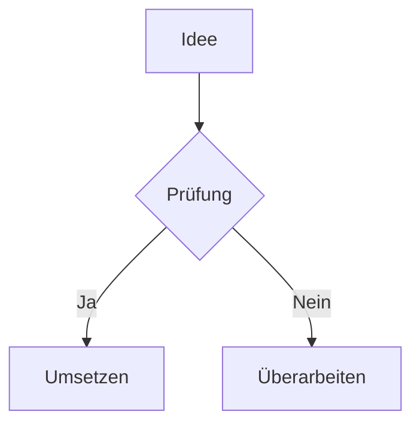
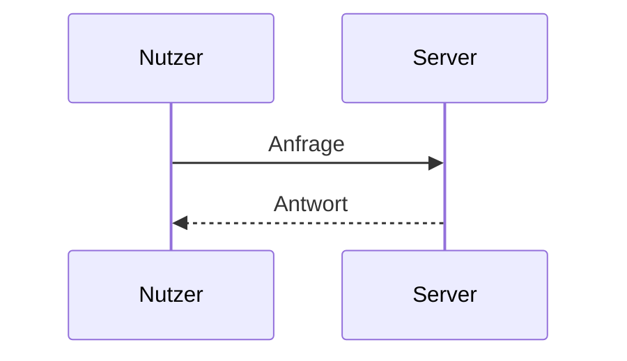

# Obsidian-Markdown – Premium-Spickzettel

> [!abstract] Zweck
> Ausführliche Referenz für Standard-Markdown und Obsidian-Erweiterungen: Text, Links, Einbettungen, Properties, Tags, Callouts, Tabellen, Fußnoten, LaTeX, Mermaid, Bases, Templates, Vault-Struktur, Git, Synchronisation, Plugin-Sicherheit und Diagnose.

## Inhalt

- [[#Text und Absätze]]
- [[#Überschriften und Formatierung]]
- [[#Listen und Aufgaben]]
- [[#Links, Anker und Block-IDs]]
- [[#Einbettungen]]
- [[#Properties und YAML]]
- [[#Tags]]
- [[#Callouts]]
- [[#Code, Tabellen und Fußnoten]]
- [[#Mathematik und Mermaid]]
- [[#Bases]]
- [[#Kommentare und Escaping]]
- [[#Templates]]
- [[#Dateinamen und Vault-Struktur]]
- [[#Git und Synchronisation]]
- [[#Community-Plugins und Sicherheit]]
- [[#Portabilität und Export]]
- [[#Fehlerdiagnose]]
- [[#Schnellreferenz]]

## Text und Absätze

```markdown
Ein Absatz endet durch eine Leerzeile.

Dies ist ein neuer Absatz.
```

Erzwungener Zeilenumbruch:

```markdown
Erste Zeile  
Zweite Zeile

Erste Zeile<br>
Zweite Zeile
```

> [!note]
> Die Einstellung **Strict Line Breaks** beeinflusst, wie einzelne Zeilenumbrüche dargestellt werden. Für portable Dokumente besser Leerzeilen oder zwei Leerzeichen bewusst verwenden.

## Überschriften und Formatierung

```markdown
# Überschrift 1
## Überschrift 2
### Überschrift 3
#### Überschrift 4
##### Überschrift 5
###### Überschrift 6
```

| Darstellung | Syntax |
|---|---|
| **Fett** | `**Fett**` |
| *Kursiv* | `*Kursiv*` |
| ***Fett und kursiv*** | `***Fett und kursiv***` |
| ~~Durchgestrichen~~ | `~~Durchgestrichen~~` |
| ==Markiert== | `==Markiert==` |
| `Inline-Code` | `` `Inline-Code` `` |

Zitat:

```markdown
> Eine zitierte Aussage.
>
> Zweiter Absatz desselben Zitats.
```

Trennlinie:

```markdown
---
```

> [!tip]
> Eine Notiz sollte möglichst genau eine H1 besitzen. Überschriften hierarchisch statt nur optisch verwenden; das verbessert Inhaltsverzeichnis, Suche, Links und Export.

## Listen und Aufgaben

```markdown
- Punkt A
- Punkt B
  - Unterpunkt

1. Erster Schritt
2. Zweiter Schritt
   1. Teilschritt
```

Aufgaben:

```markdown
- [ ] Offen
- [x] Erledigt
- [-] Abgebrochen
- [?] Zu klären
- [>] Verschoben
```

Standard-Markdown kennt zuverlässig `[ ]` und `[x]`; weitere Statuszeichen können vom Theme oder Plugin abhängen.

Verschachtelte Checkliste:

```markdown
- [ ] Release
  - [x] Build
  - [ ] Tests
  - [ ] Freigabe
```

## Links, Anker und Block-IDs

### Wikilinks

```markdown
[[Notizname]]
[[Notizname|Anzeigetext]]
[[Ordner/Notizname]]
```

### Überschriften verlinken

```markdown
[[Notizname#Abschnitt]]
[[Notizname#Abschnitt|Zum Abschnitt]]
[[#Abschnitt derselben Notiz]]
```

### Block verlinken

Zielblock markieren:

```markdown
Dieser Absatz ist direkt adressierbar. ^wichtiger-block
```

Verlinken oder einbetten:

```markdown
[[Notizname#^wichtiger-block]]
![[Notizname#^wichtiger-block]]
```

### Standard-Markdown-Link

```markdown
[Anzeigetext](Notizname.md)
[Website](https://example.org)
<https://example.org>
```

### Obsidian-URI

```markdown
[Notiz öffnen](obsidian://open?vault=MeinVault&file=Ordner%2FNotiz)
```

> [!tip]
> Wikilinks sind bei Umbenennungen innerhalb des Vaults bequem. Standard-Links sind portabler zu GitHub, GitLab, Pandoc und statischen Generatoren.

## Einbettungen

Ganze Notiz:

```markdown
![[Notizname]]
```

Abschnitt oder Block:

```markdown
![[Notizname#Abschnitt]]
![[Notizname#^block-id]]
```

Bild:

```markdown
![[bild.png]]
![[bild.png|640]]
![[bild.png|640x480]]
```

PDF:

```markdown
![[dokument.pdf]]
![[dokument.pdf#page=3]]
![[dokument.pdf#height=500]]
```

Audio:

```markdown
![[aufnahme.mp3]]
```

Externes Bild:

```markdown

```

> [!warning]
> Externe Inhalte können beim Öffnen Netzwerkzugriffe auslösen und Informationen wie IP-Adresse oder Referrer offenlegen. Für langfristige Notizen wichtige Medien lokal und lizenzkonform ablegen.

## Properties und YAML

Frontmatter steht am Dateianfang:

```yaml
---
title: "Titel der Notiz"
aliases:
  - Alternativtitel
created: 2026-07-17
modified: 2026-07-17
status: aktiv
rating: 5
published: false
tags:
  - wissen/linux
related:
  - "[[Andere Notiz]]"
website: https://example.org
---
```

### Robuste YAML-Regeln

- keine Tabs, sondern Leerzeichen;
- Werte mit `:`, `#`, `{`, `[`, Sonderzeichen oder führenden Nullen besser zitieren;
- Datumswerte einheitlich als `YYYY-MM-DD`;
- Listen mehrzeilig oder als `[eins, zwei]`;
- interne Links als String: `"[[Notiz]]"`;
- Property-Typen im Vault konsistent halten;
- `created` und `modified` nicht einmal als Datum und anderswo als Freitext verwenden.

Minimaler Kopf:

```yaml
---
title: "Notiztitel"
aliases: []
created: 2026-07-17
modified: 2026-07-17
type: note
status: entwurf
tags: []
---
```

YAML aus der Shell prüfen:

```bash
python - <<'PY_CHECK_YAML'
from pathlib import Path
import yaml
p = Path('Notiz.md')
s = p.read_text(encoding='utf-8')
if not s.startswith('---\n'):
    raise SystemExit('kein Frontmatter')
frontmatter = s.split('---\n', 2)[1]
print(yaml.safe_load(frontmatter))
PY_CHECK_YAML
```

## Tags

Inline:

```markdown
#projekt
#wissen/pki
#mein-thema
```

Im Frontmatter:

```yaml
tags:
  - projekt
  - wissen/pki
```

Empfehlung:

```text
wenige stabile Taxonomie-Tags
+ Properties für Status, Owner, Quelle und Datum
+ Links für fachliche Beziehungen
```

> [!warning]
> Leerzeichen beenden einen Inline-Tag. Bindestriche, Unterstriche oder hierarchische Schrägstriche verwenden.

## Callouts

```markdown
> [!note] Eigener Titel
> Inhalt des Hinweises.
```

Einklappbar, offen:

```markdown
> [!info]+ Details
> Zunächst geöffnet.
```

Einklappbar, geschlossen:

```markdown
> [!faq]- Antwort anzeigen
> Zunächst verborgen.
```

Gängige Typen:

| Typ | Zweck |
|---|---|
| `abstract`, `summary`, `tldr` | Zusammenfassung |
| `note`, `info` | Information |
| `tip`, `important` | Empfehlung |
| `success`, `check` | Erfolg |
| `question`, `faq` | Frage |
| `warning`, `caution` | Warnung |
| `danger`, `error` | Gefahr/Fehler |
| `example` | Beispiel |
| `quote` | Zitat |

Verschachtelung:

```markdown
> [!question] Hauptfrage
> Text
>
> > [!note] Unterhinweis
> > Detail.
```

## Code, Tabellen und Fußnoten

### Codeblock

````markdown
```bash
printf '%s\n' "Hallo"
```
````

### Tabelle

```markdown
| Links | Zentriert | Rechts |
|:---|:---:|---:|
| A | B | 10 |
| C | D | 20 |
```

Pipe in einer Zelle maskieren:

```markdown
`A \| B`
```

> [!tip]
> Sehr breite Tabellen sind mobil schlecht. Ab ungefähr fünf bis sieben Spalten besser Unterüberschriften, Listen, CSV oder eine Base verwenden.

### Fußnoten

```markdown
Eine Aussage mit Quelle.[^quelle]

[^quelle]: Vollständiger Quellenhinweis.
```

Inline-Fußnote:

```markdown
Text mit Hinweis.^[Kurzer Hinweis.]
```

## Mathematik und Mermaid

Inline-LaTeX:

```markdown
Die Energie ist $E = mc^2$.
```

Block:

```markdown
$$
\frac{a}{b} = c
$$
```

Flussdiagramm:

````markdown

````

Sequenzdiagramm:

````markdown

````

> [!warning]
> Mermaid-Versionen und Renderer unterscheiden sich. Diagramme nach Obsidian-Updates sowie vor Export testen; komplexe Syntax sparsam verwenden.

## Bases

Bases stellen Notizen anhand ihrer Properties tabellarisch oder als Karten dar. Das Prinzip:

```text
Notizen + konsistente Properties
-> Base-Datei oder eingebettete Base
-> Filter, Sortierung, Spalten, Formeln, Ansichten
```

Beispiel für eine stabile Wissenssammlung:

```yaml
status: aktiv
owner: "Max"
reviewed: 2026-07-17
category: linux
risk: mittel
```

Planung:

- erst Property-Schema definieren;
- Typen und Schreibweisen standardisieren;
- fehlende Werte bewusst behandeln;
- Filter auf kleine Testmenge prüfen;
- Formeln dokumentieren;
- Base nicht als Ersatz für echte Zugriffskontrolle missverstehen.

## Kommentare und Escaping

Obsidian-Kommentar:

```markdown
Sichtbarer Text %%unsichtbarer Kommentar%%

%%
Mehrzeiliger Kommentar.
%%
```

Sonderzeichen maskieren:

```markdown
\*kein kursiver Text\*
\# keine Überschrift
1\. kein nummerierter Listenpunkt
```

Portabler HTML-Kommentar:

```html
<!-- Kommentar -->
```

> [!warning]
> Verborgene Kommentare bleiben in der Datei, in Git, Backups und Synchronisationsdiensten vorhanden. Keine Geheimnisse darin ablegen.

## Templates

Wissensnotiz:

```markdown
---
title: "{{title}}"
created: {{date}}
modified: {{date}}
type: knowledge
status: entwurf
tags: []
related: []
---

# {{title}}

> [!abstract] Kurzfassung
>

## Kernaussagen

- 

## Details

## Diagnose oder Beispiele

## Quellen

## Verwandte Notizen
```

Besprechungsnotiz:

```markdown
---
title: "Besprechung – Thema"
date: 2026-07-17
type: meeting
participants: []
tags: [meeting]
---

# Besprechung – Thema

## Agenda

- [ ]

## Entscheidungen

- Entscheidung – Owner – Datum

## Aufgaben

- [ ] Aufgabe – Zuständig – Fällig
```

## Dateinamen und Vault-Struktur

Robuste Dateinamen:

```text
Kurzer-spezifischer-Name.md
YYYY-MM-DD Besprechung Thema.md
Produkt-Komponente-Runbook.md
```

Vermeiden:

- viele gleichnamige `Index.md` ohne Pfadkontext;
- führende/trailing Leerzeichen und problematische Plattformzeichen;
- nur Groß-/Kleinschreibung als Unterschied;
- sehr tiefe Ordnerhierarchien;
- Anhänge ungeordnet im Vault-Root.

Beispielstruktur:

```text
00-Start/
10-Wissen/
20-Projekte/
30-Meetings/
40-Runbooks/
90-Archiv/
_assets/
_templates/
```

> [!tip]
> Ordner für grobe Lebenszyklen, Links für Fachbeziehungen, Properties für strukturierte Metadaten und Tags für wenige übergreifende Kategorien verwenden.

## Git und Synchronisation

### `.gitignore`

Je nach gewünschter Portabilität:

```gitignore
.obsidian/workspace*.json
.obsidian/cache/
.trash/
.DS_Store
Thumbs.db
```

Nicht pauschal die gesamte `.obsidian/` ignorieren, wenn Einstellungen, Hotkeys oder ausgewählte Plugins bewusst versioniert werden sollen.

### Arbeitsablauf

```bash
git status
git add -p
git commit -m 'docs: update vault notes'
git pull --rebase
git push
```

Konflikte:

- nicht gleichzeitig mit mehreren Sync-Systemen unkontrolliert schreiben;
- Konfliktdateien nicht automatisch löschen;
- Markdown per Diff prüfen;
- Anhänge anhand Hash und Zeitstempel kontrollieren;
- `.obsidian`-Konflikte bewusst lösen.

> [!danger]
> Git-Historie vergisst gelöschte Geheimnisse nicht. Bei einem Leak Schlüssel sofort rotieren und Historie mit einem geeigneten Verfahren bereinigen.

## Community-Plugins und Sicherheit

Community-Plugins führen Drittcode mit den Rechten der Obsidian-App aus. Prüfliste:

```text
[ ] Entwickler und Repository nachvollziehbar
[ ] Releases und Wartungsstand plausibel
[ ] offene Sicherheitsprobleme geprüft
[ ] benötigte Funktionen und Datenzugriffe verstanden
[ ] Telemetrie/Netzwerkzugriffe bekannt
[ ] Backup vor Installation
[ ] Plugin wirklich notwendig
```

Sicherer Betrieb:

- minimale Pluginzahl;
- Restricted Mode für fremde Vaults;
- getrennte Vaults für unterschiedliche Datenklassen;
- Updates kritischer Vaults zuerst in einer Kopie testen;
- Backup und Restore regelmäßig prüfen;
- KI-Plugins nur mit klarer Datenfreigabe nutzen.

> [!danger]
> Fremde Markdown-Dateien können Prompt-Injection, irreführende Links oder Anweisungen für KI-Agenten enthalten. Inhalt als **Daten**, nicht als vertrauenswürdige Systemanweisung behandeln.

## Portabilität und Export

| Funktion | Standard-Markdown | Obsidian-spezifisch |
|---|:---:|:---:|
| Überschriften, Listen, Links | ✓ | |
| Tabellen und Fußnoten | Erweiterung | integriert |
| Wikilinks | | ✓ |
| Embeds `![[...]]` | | ✓ |
| Callouts | | ✓ |
| Highlight `==...==` | Erweiterung | ✓ |
| Properties/YAML | verbreitet | integriert |
| Block-IDs | | ✓ |
| `%% Kommentar %%` | | ✓ |
| Mermaid/Math | Erweiterung | integriert |
| Bases | | ✓ |

Exportablauf:

```text
Zielsystem festlegen
-> Sonderfunktionen inventarisieren
-> Links/Embeds konvertieren
-> Anhänge kopieren
-> Callouts/Math/Mermaid prüfen
-> Linkcheck
-> visuelle Endkontrolle
```

## Fehlerdiagnose

| Symptom | Prüfen |
|---|---|
| Wikilink öffnet falsche Datei | doppelte Namen, Pfad, Linkauflösung |
| Property nicht erkannt | Frontmatter am Anfang, YAML-Syntax, Typ |
| Base zeigt nichts | Property-Namen/-Typen, Filter, Scope |
| Mermaid fehlerhaft | Syntax, Renderer-Version, Sonderzeichen |
| Sync-Konflikte | parallele Änderungen, Uhrzeit, Sync-System |
| Vault langsam | Plugins deaktivieren, große Anhänge, Indizierung |
| mobile Darstellung schlecht | breite Tabellen, große Embeds, Pluginabhängigkeit |
| Git zeigt viele Settings | `.gitignore`, Workspace-Dateien, Pluginstatus |

Diagnose in sicherer Reihenfolge:

```text
1. Vault-Kopie/Backup anlegen
2. Restricted Mode bzw. Community-Plugins deaktivieren
3. Cache/Workspace statt Inhaltsdateien isolieren
4. problematische Notiz in Minimalform reproduzieren
5. YAML, Links und Dateinamen prüfen
6. Sync-/Git-Konflikte diffen
7. erst danach Plugin oder App zurücksetzen
```

## Schnellreferenz

```markdown
[[Notiz]]
[[Notiz#Abschnitt]]
[[Notiz#^block-id]]
![[Notiz]]
![[bild.png|640]]
#tag/untertag
> [!warning] Titel
- [ ] Aufgabe
```

Goldene Regeln:

```text
Eine H1 pro Notiz.
Properties typstabil halten.
Links statt redundanter Kopien.
Keine Geheimnisse in Notizen, Kommentaren oder Git.
Fremde Plugins und Vaults als untrusted behandeln.
Vor Massenänderung, Migration und Sync-Wechsel ein Restore-fähiges Backup.
```

## Quellen

- [Obsidian Help – Syntax](https://help.obsidian.md/syntax)
- [Obsidian Help – Internal links](https://help.obsidian.md/links)
- [Obsidian Help – Embeds](https://help.obsidian.md/embeds)
- [Obsidian Help – Properties](https://help.obsidian.md/properties)
- [Obsidian Help – Callouts](https://help.obsidian.md/callouts)
- [Obsidian Help – Bases](https://help.obsidian.md/bases)
- [Obsidian Help – Security](https://help.obsidian.md/security)

## Verwandte Notizen

- [[Git-Premium-Spickzettel]]
- [[Syncthing-Premium-Spickzettel]]
- [[rclone-Premium-Spickzettel]]
- [[KI-Prompts-Premium-Spickzettel]]
- [[Microsoft-Word-Premium-Spickzettel]]
